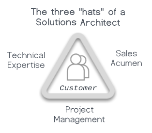
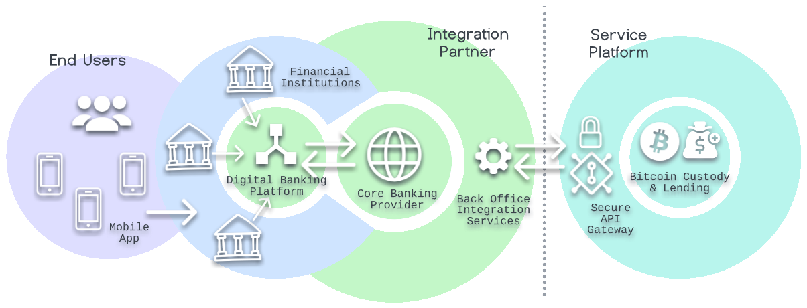

# _About the Developer_

Hi! I'm a technical solutions professional with over 16 years of software engineering experience, specializing in developer platforms, APIs & SDKs, and cloud services. In a sales engineering capacity, I love building relationships with partners and understanding their business needs deeply. In advocacy of the developer, I partner with internal product engineering teams to drive new features and to release incredible new products to market. My ultimate goal is to bring delight to the end users, all while building an ever more efficient, secure, and profitable API product platform.

As a cryptocurrency investor and enthusiast since 2017, I'm passionate about Web3 and the future of democratized digital finance. In my spare time, I enjoy running blockchain nodes and contributing to various projects, such as Trace Labs' recent World Economic Forum-sponsored [Trusted COVID-19 Essential Supplies Repository](https://www.weforum.org/agenda/2021/02/origintrail-blockchain-covid-supplies-repository/).

# _About the Project_
This API platform proof-of-concept (PoC) enables banking integration partners to offer their end-users the ability to obtain a USD loan against their Bitcoin position. Complete API documentation for the Service Platform is included, along with a dedicated integration guide that presents a mobile app reference implementation. All content is my own, authored in calendar Q2 of 2022.

### High-Level Architecture

# _Partner Integration Guide_

    <iframe class="guide-iframe" src="artifacts/Bitcoin-Secured-Lending-Integration-Guide.pdf"  title="Bitcoin-Secured Lending Integration Guide" style="border:none;width:54%;height:700px;padding-left:28px"></iframe>
    
The <a href="file:artifacts/Bitcoin-Secured-Lending-Integration-Guide.pdf">Partner Integration Guide</a> is available for download.

# _API Design_
The [API Design document](file:artifacts/Bitcoin-Secured-Lending-API-Design.pdf), complete with market analysis and product research is available for download.

  

REST API DOCUMENTATION

# Overview
We're pleased to offer a brand new Lending API to make it possible for our partners to develop solutions that enable their end-users to obtain a USD loan against their Bitcoin position. This section contains the API endpoints and the request and response schemas for all methods required to integrate to the platform.

## Postman Collection
The quickest way to get started is to use our <a href="artifacts/postman.json" download>Postman</a> request collection. The following steps will help you get up and running. If you prefer, our API can also easily be explored with other tools, like cURL.

### 1) Open the Postman Collection

### 2) Configure the Postman Environment

 * Setup a new environment by clicking the Gear icon at top right
 * Name the new environment _Bitcoin Lending_ and click _Add_ to create
 * Expand the _GET STARTED_ folder and select the _Environment Setup_ method
 * Select the _Pre-req._ tab and set `bearer-token` to the Access Token Value previously obtained
 * Click the _Send_ button

### 3) Explore the API

 * Execute any of the requests within the collection
 * Refer to this documentation for the requirements of each method

<aside class="warning">
If Postman returns a <i><b>"Could not get any response"</b></i> error, most likely you need to set the environment (as in step #2 above).
</aside>